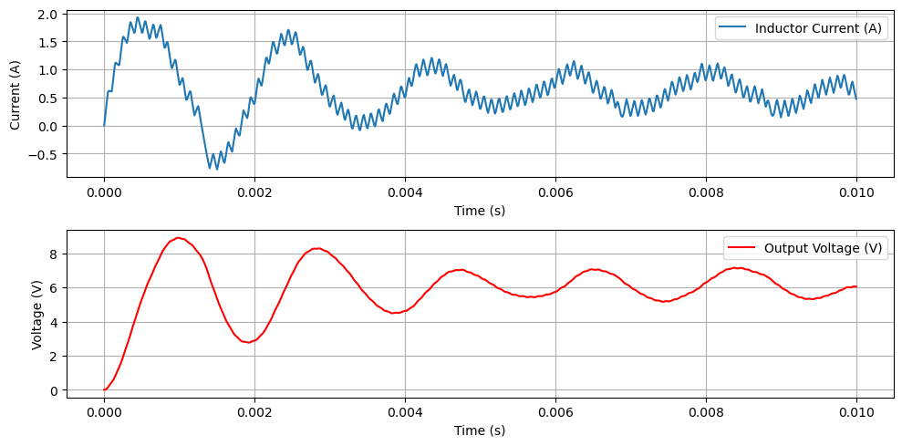
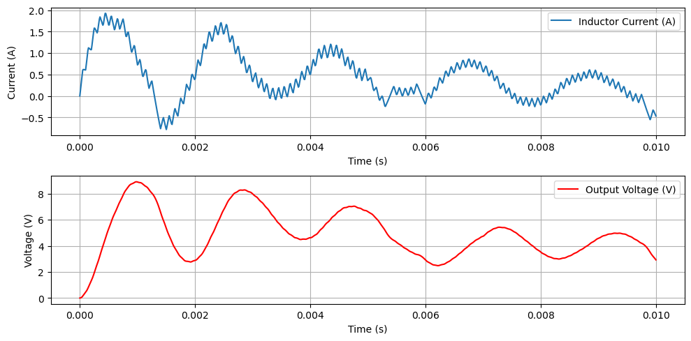
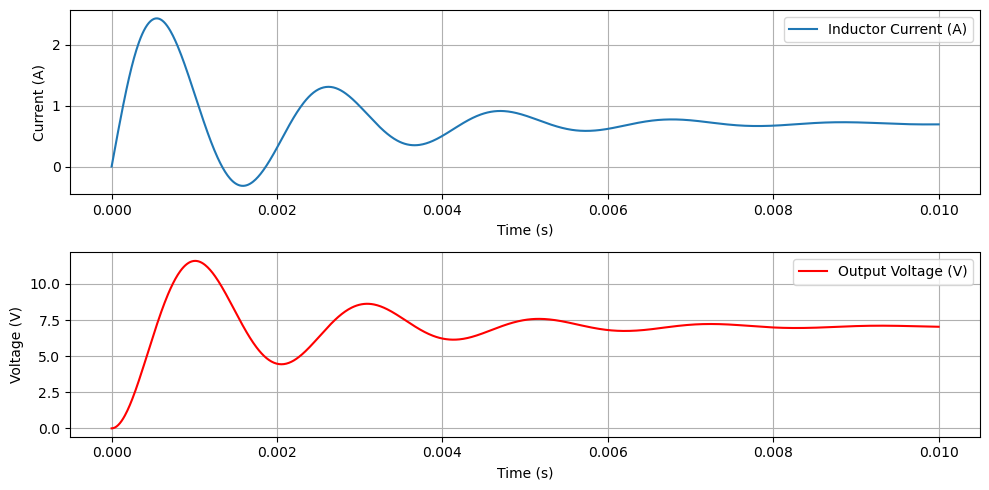

#  Buck Converter Simulation with Perturbation and Control

This repository contains a simulation of a **DC-DC Buck Converter** implemented in Python using a Jupyter Notebook. The simulation illustrates the converter's behavior across different phases:

-  **Before perturbation** (normal operation)
- **After perturbation** (disturbed system)
-  **With control** (system stabilized via feedback)

---

##  Objectives

This project aims to:

1. **Simulate the time-domain behavior** of a buck converter using numerical integration of its differential equations.
2. **Introduce perturbations** (e.g., load or source variation) to test robustness.
3. **Apply a control strategy** to regulate the output voltage back to its desired value.

---

##  Simulation Phases

###  Before Perturbation

The converter operates under nominal conditions with a predefined duty cycle, producing a stable output voltage.


> 

---

###  After Perturbation

A disturbance is introduced (e.g., sudden load change or input variation), causing deviation in the output voltage and system instability.
_
> 

---

###  Control Phase

The control mechanism is activated to compensate for the disturbance and bring the output voltage back to its reference value.


> 

---

## Control Method Used

###  Control by Neural Network (Supervised Learning)

The control strategy implemented in this project is based on **machine learning**, specifically a **supervised neural network**. The neural network learns to compute the **duty cycle** that will stabilize the output voltage, based on the system's state.

#### Model Architecture

- Input: 2-dimensional vector (e.g., output voltage \( V_{out} \), reference voltage \( V_{ref} \))
- Hidden Layers: Two dense layers with 32 neurons and ReLU activation
- Output Layer: One neuron with **sigmoid** activation to produce a duty cycle \( D \in [0, 1] \)

```python
class BuckNN(nn.Module):
    def __init__(self):
        super(BuckNN, self).__init__()
        self.fc1 = nn.Linear(2, 32)
        self.fc2 = nn.Linear(32, 32)
        self.fc3 = nn.Linear(32, 1)
        self.activation = nn.ReLU()

    def forward(self, x):
        x = self.activation(self.fc1(x))
        x = self.activation(self.fc2(x))
        x = torch.sigmoid(self.fc3(x))
        return x
